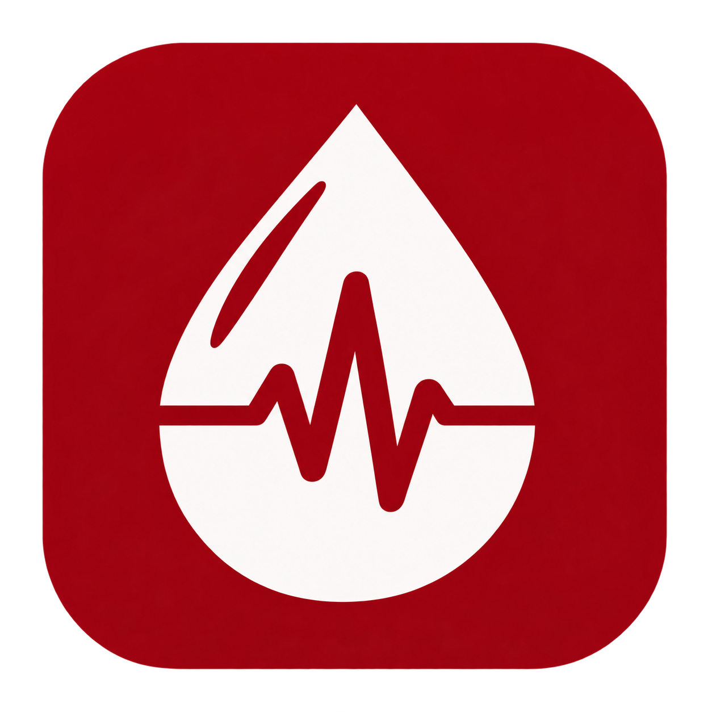

<div align="center">



# 🩸 BloodConnect — Blood Donation & Emergency Management App

### *Because "I need blood NOW" shouldn't depend on a lucky WhatsApp forward.*

An Android app engineered to turn blood donation from a panic-driven scramble into a **real-time, intelligent, life-saving network.**

[](#)
[](#)
[](#)
[](#)
[](#)

</div>

---

## ⚡ The Problem

> Every **2 seconds**, someone needs blood. Yet finding the *right* donor, at the *right* time, in the *right* place — still runs on phone trees and hope.

- 🩸 Donor discovery is slow and manual
- 📱 Requests scatter across chat apps, causing duplication & panic
- 😮‍💨 First-time donors rarely become *repeat* donors — no visibility, no incentive
- 🏥 Hospitals need verified, real-time channels to broadcast urgent needs

**We are building the fix.**

---

## 🏗️ Current Architecture & Foundation

The core app skeleton is fully established using modern Android best practices:
- **MVVM Architecture** with Jetpack Compose & Material 3
- **Dependency Injection** via Dagger Hilt
- **Navigation & Routing** setup with Jetpack Navigation Compose
- **Backend Foundations** prepared with Firebase (Auth, Firestore, Cloud Messaging) and Location services

---

## 🛠️ Tech Stack

| Layer | Technology |
|---|---|
| **Language** | Kotlin |
| **UI Framework** | Jetpack Compose & Material 3 |
| **Dependency Injection** | Dagger Hilt & Hilt Navigation Compose |
| **Navigation** | Navigation Compose |
| **Backend & Database** | Firebase Auth & Firebase Firestore |
| **Notifications** | Firebase Cloud Messaging (FCM) |
| **Location Services** | Google Play Services Location (`play-services-location`, `kotlinx-coroutines-play-services`) |
| **Permissions** | Accompanist Permissions |

> *Future Considerations:* AI conversational pre-screening, QR-based digital donor passport verification, and advanced smart-matching algorithms are slated for upcoming phases.

---

## 📂 Project Structure

```text
com.bloodconnect.app/
├── data/
│   ├── model/         # Data classes (User, BloodRequest)
│   └── repository/    # Firebase & local data repositories
├── di/
│   └── FirebaseModule # Hilt module providing FirebaseAuth & FirebaseFirestore
├── navigation/
│   ├── NavGraph.kt    # Compose NavHost routing definition
│   └── Screen.kt      # Sealed class defining app navigation routes
├── ui/
│   ├── auth/          # Login & Registration screens (In Progress)
│   ├── components/    # Reusable UI components
│   ├── donor/         # Donor search & matching screens
│   ├── home/          # Home dashboard
│   ├── profile/       # User profile & donor passport
│   ├── request/       # Blood request creation & management
│   └── theme/         # Material 3 Theme, Color, and Typography
└── util/              # Helper utilities & location wrappers
```

---

## ✨ Feature Status

### ✅ Implemented (Base Skeleton & Architecture)
- [x] Project architecture & Hilt dependency injection setup (`BloodConnectApp`, `FirebaseModule`)
- [x] Material 3 custom blood-red theme with light/dark mode support (`Theme.kt`, `Color.kt`, `Type.kt`)
- [x] Navigation Compose scaffolding with sealed route definitions (`Screen.kt`, `NavGraph.kt`)
- [x] AndroidManifest configuration with internet, location, and notification permissions
- [x] Base Gradle dependencies for Compose, Hilt, Firebase, and Location services

### 🚧 In Progress & Planned Features
- [ ] User authentication (Login & Register screens with Firebase Auth)
- [ ] Real-time donor registration & profile management
- [ ] Location-radius and blood-group-based donor search
- [ ] Emergency blood request creation and FCM broadcast
- [ ] SOS Critical Alert Mode & Live ETA tracking
- [ ] Digital Donor Passport with QR verification
- [ ] Donor tiers, streaks & "Lives Saved" counter dashboard

---

## 📲 Getting Started

### Prerequisites
- Android Studio (Narwhal / Koala or newer recommended)
- JDK 17
- A Firebase Project with **Authentication**, **Firestore**, and **Cloud Messaging** enabled.

### Installation & Setup

1. **Clone the repository:**
   ```bash
   git clone https://github.com/sylbornfurtado19/BloodConnect.git
   cd BloodConnect
   ```

2. **Add Firebase configuration:**
   - Download your `google-services.json` file from your Firebase Console.
   - Place it directly inside the `app/` directory (`app/google-services.json`).

3. **Build & Run:**
   - Open the project in Android Studio.
   - Sync Gradle files.
   - Run the app on an emulator or physical device (`▶️`).

---

## 👥 Team

| Roll No. | Name |
|---|---|
| N024 | Ranish Devadiga |
| N025 | Yug Dhaigude |
| N027 | Sylborn Furtado |
| N042 | Hriday Jain |

*MBA Tech, Computer Engineering — MPSTME, NMIMS*

---

<div align="center">

### 🩸 One tap can save three lives. Let's make finding the tap effortless.

**⭐ Star this repo if you believe blood donation deserves better tech.**

</div>
